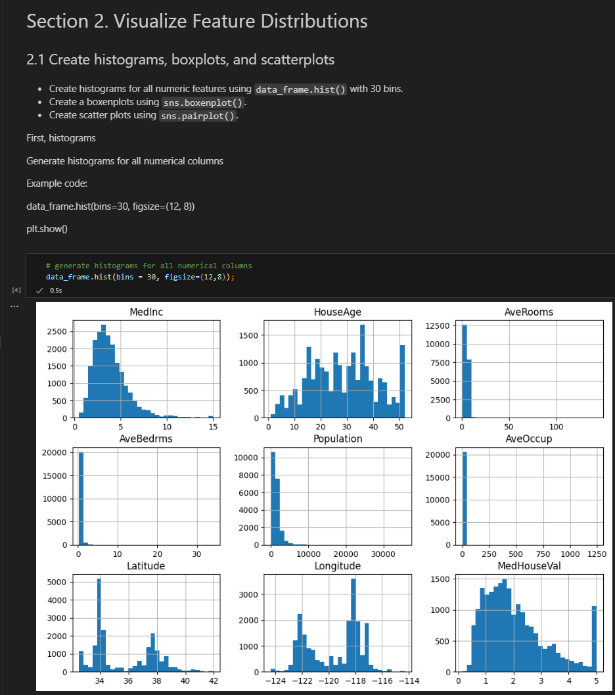

# Jordan Project 01
### Author:  [JfromNWMS](https://github.com/JfromNWMS)

## Overview
Businesses and organizations often need to understand the relationships between different factors to make better decisions.
For example, a company may want to predict the fuel efficiency of a car based on its weight and engine size or estimate home prices based on square footage and location.
Regression analysis helps identify and quantify these relationships between numerical features, providing insights that can be used for forecasting and decision-making.

This project is a guided notebook assignment that demonstrates how to:
- Load and explore a dataset.
- Choose and justify features for predicting a target variable.
- Train a regression model.
- Document work in a structured Jupyter Notebook.

A link to the notebook can be found here: [jordan_ml01.ipynb](https://github.com/JfromNWMS/applied-ml-jordan/blob/main/notebooks/project01/jordan_ml01.ipynb)

## Instructions to Set up Virtual Environment

Run these commands in your VS Code terminal:

```shell
# 1. Create an isolated virtual environment
uv venv

# 2. Pin a specific Python version (3.12 recommended)
uv python pin 3.12

# 3. Install all dependencies, including optional dev/docs tools
uv sync --extra dev --extra docs --upgrade

# 4. Enable pre-commit checks so they run automatically on each commit
uv run pre-commit install

# 5. Verify the Python version (should show 3.12.x)
uv run python --version
```

Next, activate the virtual environment.

Windows (PowerShell):

```script
.\.venv\Scripts\activate
```

macOS / Linux / WSL:

```script
source .venv/bin/activate
```

## Instructions to Run Jupyter Notebook Locally

### Install the Jupyter Extension for VS Code:

Open the Extensions view in VS Code by pressing Ctrl+Shift+X (Windows/Linux) or Cmd+Shift+X (Mac).
Search for "Jupyter" and install the official extension.
Open the notebook in VS Code. The file will have a .ipynb extension.

### Task 1. Select Notebook Kernel
Open the notebook (.ipynb) file in VS Code.
If prompted, select a Python interpreter that corresponds to your project’s .venv.
If not prompted:
Click the Kernel Selector in the top-right corner.
Choose the interpreter labeled with your project name and path.
Or open the Command Palette (Ctrl Shift P / Cmd Shift P) and run: Python: Select Interpreter, then pick your .venv.

### Task 2. Start and Run the Notebook
To run notebooks directly in VS Code, click on a cell and press:
<br>Shift Enter to run cell and move to next
<br>Ctrl Enter to run cell and stay in place
<br>Save often or enable File / Auto Save.

## Example Analysis

